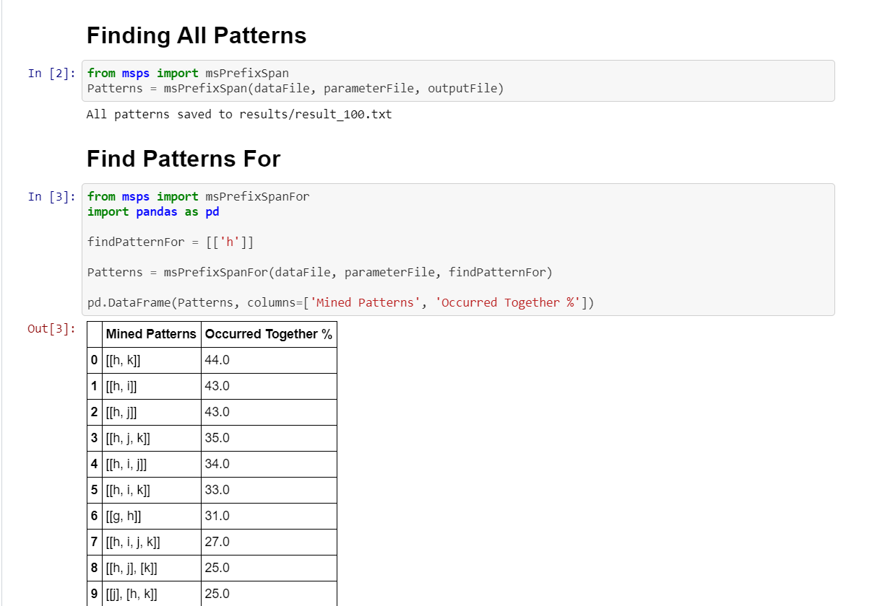

# Pattern Mining/Recommendation (MS-PrefixSpan)

An algorithm that mines important patterns from unsupervised sequential data. It allows you to define what's important. Recommendations or other business decsions can then be made using the found patterns.

By Abdullah Aleem and Hamidreza Almasai  
For Data Mining and Text Mining by Bing Liu  
At Univeristy of Illinois at Chicago  

---

### Why use this ?

The legend says that a study was done by a retail grocery store.  The findings were that men between 30- 40 years in age, shopping between 5pm and 7pm on Fridays, who purchased diapers were most likely to also have beer in their carts.  This motivated the grocery store to move the beer isle  closer to the diaper isle and wiz-boom-bang, instant 35% increase in sales of both. [Link](http://canworksmart.com/diapers-beer-retail-predictive-analytics/)

For supervised data even simple algorithms can produce good recommendations but in most cases we dont have labeled data (retail) or labeling it requires alot of resources. To solve this, I have implemented msPrefixSpan which works with unsupervised data and the latest improvement allow you to set an importance threshold of each item and get rid of patterns with item you dont care about (see How to?).

### How to use this?

1. Each row in data file represents 1 customer. Each sub list represents a single transaction.
e.g. [['Bread, 'Peanut Butter']['Almond Butter']] means bread and peanut butter were bought togther first and later the same person bought Almond butter (for a change maybe).
2. Parameter file contains something known as 'MIS value' and 'SDC'. MIS value tells us that in what percentage of transactions the item must be present for it to be important (otherwise the algorithm won't mine it). SDC tells us whats the accepted difference between two items. e.g. milk is bought more frequently than peanut butter, hence peanut butter will have a lower MIS value for it to be considered important. 
3. Lastly, this algorithm is very easy to use (shown below). As of now, there are two ways in which you can use it. To find all (important) patterns in the data and to find patterns for a certain set of items (make sure the pattern of the set is whats shown in 1)

### With what data?

For now, there are 2 data sets available 'data_100' and data_1000'. These datasets were randomly generated for testing purpose and do not correspond to a real world situation. However, if you have any sequential data, feel free to try this algorithm on that and share the data with me, if possible.

For short demo on how to use this algorithm see 'example.ipynb' or [Click Here](https://github.com/abaleem/pattern-mining/blob/master/example.ipynb)
